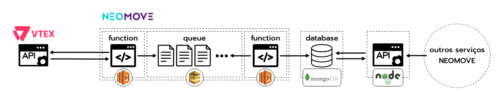

# Requisitos do Pacote: API Neomove - VTEX

O objetivo desse pacote é realizar uma interação mais ampla com a API da VTEX. Hoje, a API da VTEX não atende nossas requisições por causa do *throttling* e o limite de paginação. Dessa forma, precisamos construir um *adapter* (não exatamente no sentido de *design patterns*, mas semelhante no conceito) que traga os dados da VTEX para uma infraestrutura NEOMOVE e, então, esses dados poderão ser consumidos por nossos serviços através de uma API.

## Arquitetura

A arquitetura que estamos propondo para este projeto está disposta abaixo:

Essa arquitetura incorpora 5 serviços distintos:
  - Função &lambda; que, a cada período pré-definido, realiza as requisições necessárias para a [API VTEX](https://documenter.getpostman.com/view/487146/vtex-orders-api/6tjSKqi#5e8d71a0-a383-4bdf-94ec-d115c703bfdc) e adiciona as informações em um grupo de filas a serem consumidas. Essas filas são necessárias justamente devido ao *throttling* e o limite de paginação da API. Sugerimos utilizar o **AWS Lambda** para esse serviço.
  - *Queue* (fila) com as informações obtidas pela função &lambda; anterior. Sugerimos utilizar o **AWS SQS** para esse serviço.
  - Função &lambda; que, a cada período pré-definido, verifica e adiciona as informações que estão na fila no banco de dados. A verificação deverá garantir que não são adicionados dados duplicados no banco e também que os status/informações dos pedidos/usuários foram atualizados corretamente, por exemplo, um pedido pode ser criado com o status de **esperando pagamento** e após 2 dias aquele status irá ser alterado para **pedido enviado**.
  - Banco de Dados MongoDB para garantir a performance e a facilidade na integração com a API em *node.js*.
  - API em *node.js* com as saídas para que as informações do banco sejam consumidas pelos outros serviços da NEOMOVE.

## API node.js

Nossa sugestão para a API *node.js* é criar um pacote que tenha funções que funcionem de forma semelhante às do pacote [npm magento](https://www.npmjs.com/package/magento). Lembrando que no caso da nossa API, só iremos consumir essas informações.
